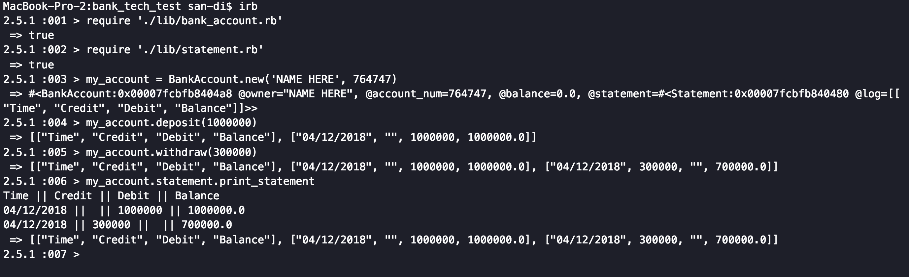
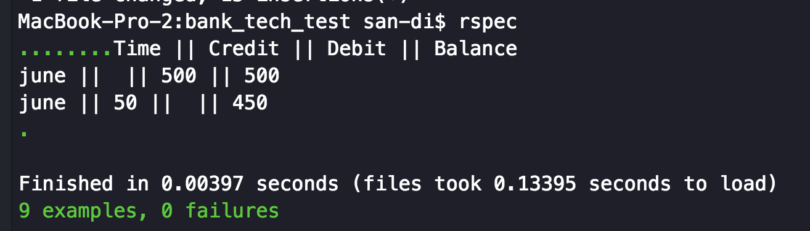

# Bank Tech Test
-----

### Overview:
      This tech test is a demonstration for Objective Oriented
      design (OOD) and Test Driven Development (TDD). The goal
      is not to complete a simple challenge in a fast timeframe,
      but to meticulously outline my OOD and TDD process.

### How to run:
   * Clone this repository to your local machine
      ```
      $git clone https://github.com/RyanWolfen7/bank_tech_test.git
      ```
   * Bundle install gems
      ```
      $ bundle install
      ```
   * Run rspec
      ```
      $rspec
      ```
   * Copy the Path to simple cov file and open in your browser
   * Open IRB
      ```
      $ irb
      ```
   * Require files
      ```
      require './lib/bank_account.rb'
      require './lib/statement.rb'
      ```
   * Create new BankAccount
       ```
       my_account = BankAccount.new('NAME HERE', 764747
      ```
   * Deposit monies
       ```
       my_account.deposit(1000000)
       ```
   * Withdraw some
       ```
       my_account.withdraw(300000)
       ```
   * Print statement
        ```
        my_account.statement.print_statement
       ```
### Example:

  


## Specification
------

### Requirements:

  * You should be able to interact with your code via a REPL like IRB or the JavaScript console.  (You don't need to implement a command line interface that takes input from STDIN.)
  * Deposits, withdrawal.
  * Account statement (date, amount, balance) printing.
  * Data can be kept in memory (it doesn't need to be stored to a database or anything).

### Acceptance criteria

  **Given** a client makes a deposit of 1000 on 10-01-2012  
  **And** a deposit of 2000 on 13-01-2012  
  **And** a withdrawal of 500 on 14-01-2012  
  **When** she prints her bank statement  
  **Then** she would see

  ```
  date || credit || debit || balance
  14/01/2012 || || 500.00 || 2500.00
  13/01/2012 || 2000.00 || || 3000.00
  10/01/2012 || 1000.00 || || 1000.00
  ```


## Process
---

### SetUp:
  * I began by creating a git hub repository and cloning it to my local machine
  * I then write my tentative Readme and push to my repository
  * I then brainstorm what my arch-objectives are and what I will need to solve them
    * I determine that the problem could best be implemented with Ruby, as it has a many functions that will add to the ease of developing this project and has a lot of supporting gems that will help with TDD.
    * Since I am using Ruby, I have decided to use SimpleCov, Rspec, and Rubocop as my initial gems.
        * SimpleCov to make sure I have good test coverage
        * Rspec as my testing framework
        * Rubocop as a convention linting framework
    * I then decide I will use a wire map diagram for my model
    * Then I will create user stories
  * I then install and init the Bundle gem
  * I then init Rspec
    * Insert the SimpleCov start in spec_helper
    * Ran Rspec
  * Created my Lib and assets folder
    * Created a domain_model folder and user_stories.md
  * Wrote the first user story
  * Created the domain_model.md
    * Wrote in the first user story
  * Created bank.rb and bank_spec.rb
    * Ran rspec
    * Wrote first test

### First Test:
##### Error 1:

##### Solution:

##### Error 2:

##### Solution:

##### Error 3:

##### Solution:

##### Error 4:

Looks like I made a typo in my rspec. An easy fix; this is good news because it means its accessing my attr_reader
##### Error 5:

##### Solution:

##### Error 6:

##### Solution:


#### Conclusion


### The Rest Of The Project

      For the rest of the project I will be uploading a video to
      the readme. I will possible add a voice overlay to explain
      in further detail.
[Video Here](https://www.youtube.com/watch?v=bAgqDwj7vXE)

## Running Program



